# Demo-Stammbaum „Familie Falkenrath“

[English](README.md) · **Deutsch**

Ein kleiner, **frei erfundener** Stammbaum zum Ausprobieren und Testen von webtrees, dem Modul
*api4webtrees* und der Apps *wtAnd*, *wtWin* und *wtTux*: 492 Personen, 154 Familien, 204 Quellen,
40 Archive, 142 Bilder, von um 1750 bis heute.

**Alle Personen, Lebensdaten und Dokumente sind ausgedacht.** Übereinstimmungen mit lebenden oder
verstorbenen Personen sind Zufall. Die Orte gibt es wirklich – sie tragen Koordinaten, damit Karten etwas
zu zeigen haben.

**Die Porträts sind echte alte Atelierfotos unbekannter Personen** aus dem Rijksmuseum Amsterdam (CC0, über
Wikimedia Commons). Die Abgebildeten haben mit den erfundenen Namen nichts zu tun; Liste der Quellen in
[FOTOS.md](FOTOS.md). Bewusst nicht jeder hat ein Bild – wie in echten Stammbäumen: die direkten Vorfahren
meist, Seitenlinien seltener, vor 1860 niemand, und ab 1920 Geborene keine (freie Fotos aus dieser Zeit gibt es
kaum, und die Jüngeren sind privat). Urkunden, Kirchenbuch- und Registerauszüge, Werkstatt und Hochzeitsbild sind gezeichnet.

Lizenz: [CC0 1.0](https://creativecommons.org/publicdomain/zero/1.0/deed.de) – frei verwendbar, auch für
Screenshots und Vorführungen.

**Versionen:** Diese Datei ist immer die neueste Version (siehe `2 VERS` im Kopf). Jede Version liegt eingefroren in
[versionen/](versionen/) – dort stehen auch die Regeln, wie neue Finessen hinzukommen.

**Herunterladen:** [nur die GEDCOM-Datei](https://github.com/thobgg/falkenrath-demo-tree/raw/main/falkenrath.ged) (470 KB) ·
[GEDCOM mit allen Bildern als Zip](https://github.com/thobgg/falkenrath-demo-tree/releases/latest/download/falkenrath-1.3.zip) (7 MB) ·
[als GEDZIP](https://github.com/thobgg/falkenrath-demo-tree/releases/latest/download/falkenrath-1.3.gdz) (7 MB, wie webtrees 2.2 es exportiert: `gedcom.ged` plus Bilder) ·
[alle Versionen](https://github.com/thobgg/falkenrath-demo-tree/releases)

## Bilder

<p align="center">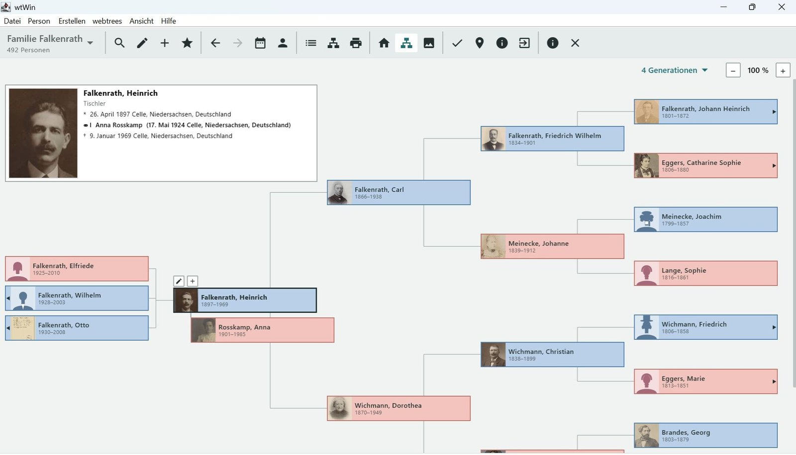</p>
<p align="center"><sub>Der Baum in <a href="https://github.com/thobgg/app4webtrees">wtWin</a>: Heinrich Falkenrath mit seinen Kindern und vier Generationen Vorfahren.</sub></p>

<p align="center">
  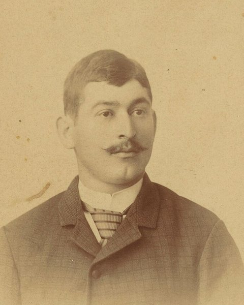
  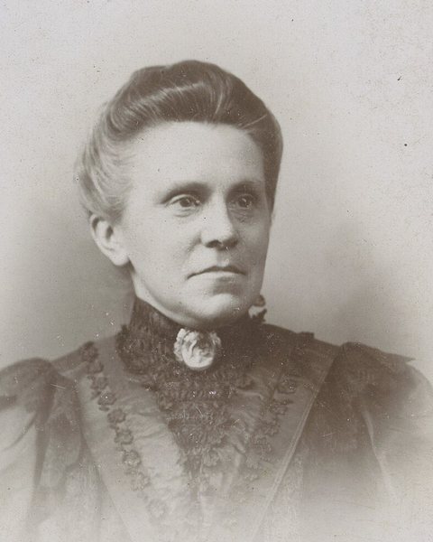
  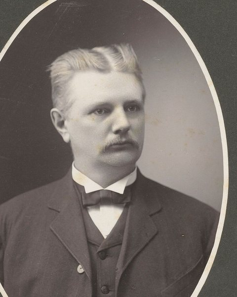
  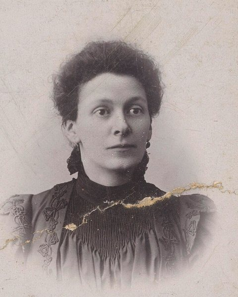
  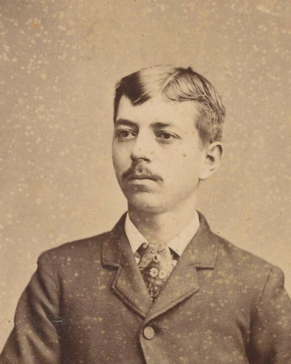
  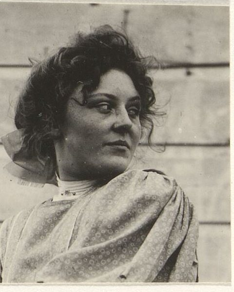
</p>
<p align="center"><sub>Porträts: echte Atelierfotos <b>unbekannter Personen</b> aus dem Rijksmuseum Amsterdam, gemeinfrei (CC0).
Die Abgebildeten haben mit den erfundenen Namen des Baums nichts zu tun. Quelle jeder Datei in <a href="FOTOS.md">FOTOS.md</a>.</sub></p>

<p align="center">
  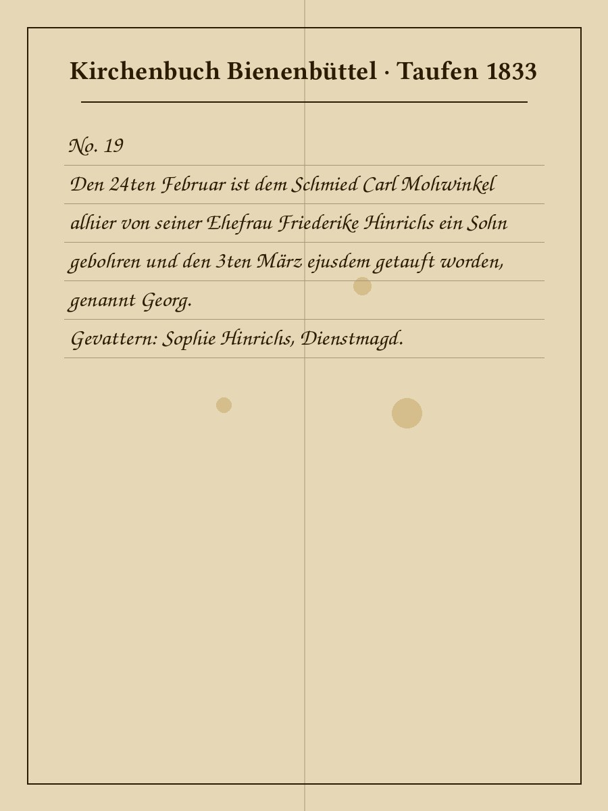
  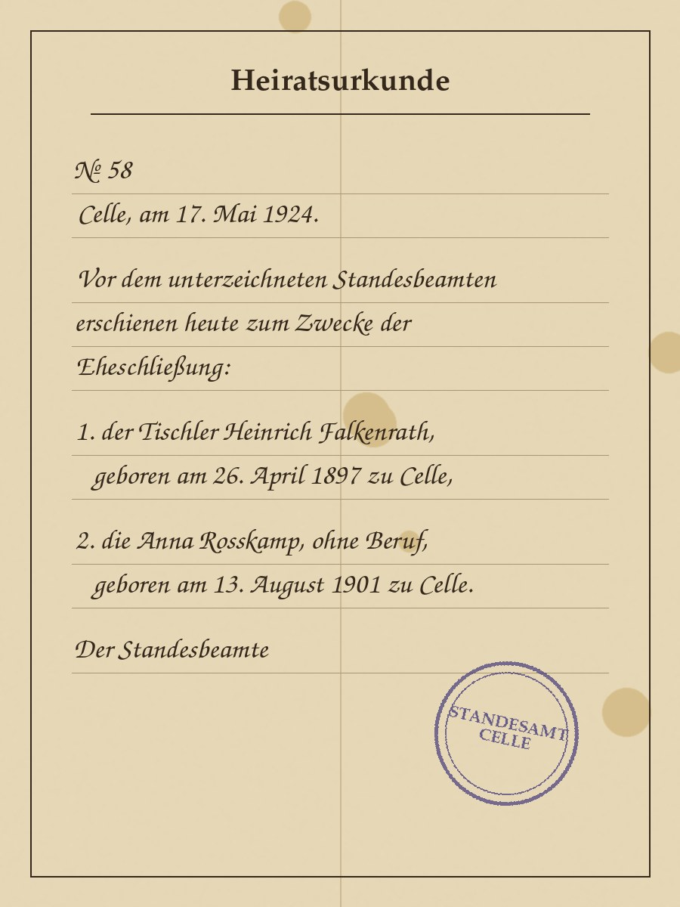
  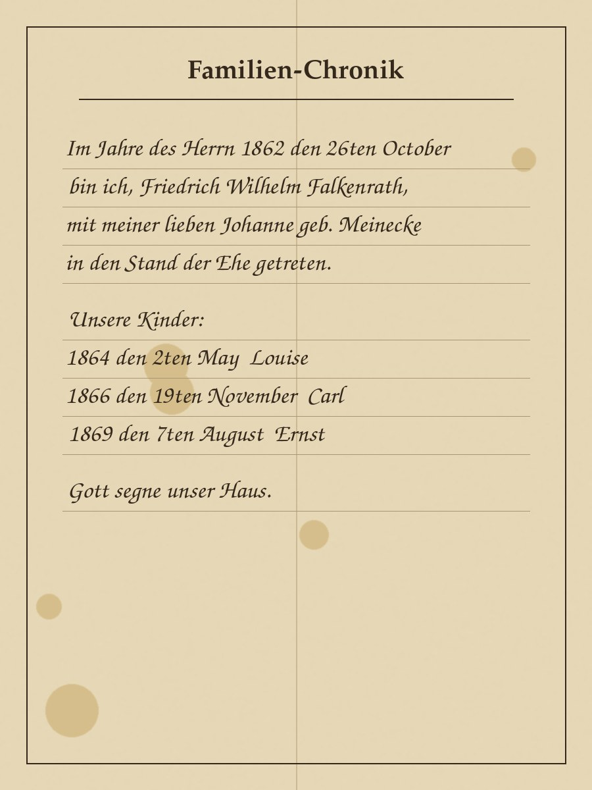
  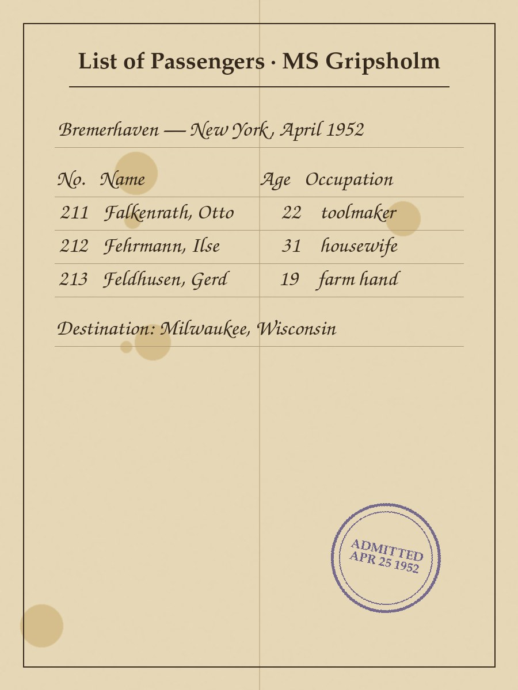
</p>
<p align="center"><sub>Kirchenbucheinträge, Urkunden, Familienchronik und Schiffsliste sind <b>für diesen Baum gezeichnet</b>.
Ihr Text passt zu den Daten im GEDCOM, damit Apps neben dem Scan die Abschrift zeigen können.</sub></p>

<p align="center">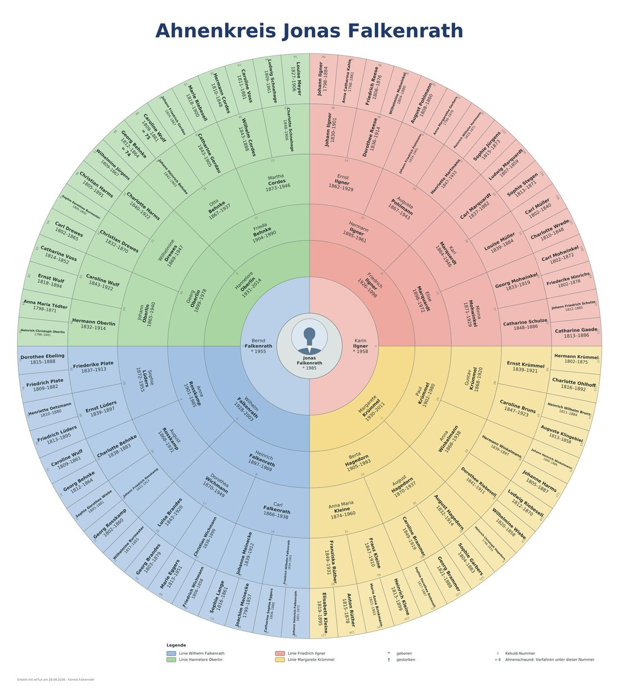</p>
<p align="center"><sub>Ahnenkreis von Jonas Falkenrath: sieben Generationen lückenlos, 127 Ahnen.</sub></p>

Alle Bilder in diesem Repository sind unter CC0 frei verwendbar, auch die beiden Bildschirmfotos. Bei den Porträts
bitte die Abgebildeten außerhalb einer Vorführung nicht als Mitglieder der Familie Falkenrath ausgeben: Es sind
echte, unbekannte Menschen.

## Was der Baum abdeckt

Lebende Personen (Datenschutz), zwei Ehen mit früh verstorbenem Kind, Gefallene beider Weltkriege,
zwei Auswanderungen nach Milwaukee (1888 und 1952) samt amerikanischem Zweig, eine Scheidung, eine unbekannte
Mutter an der Spitze, Vettern und Cousinen auf Vater- und Mutterseite, Quellen mit Seitenangaben, Notizen,
Rufname, Orte mit Koordinaten, Medien an Personen, Familien und Quellen.

Seit September 2026 außerdem: die Vorfahren von Jonas **lückenlos über sieben Generationen** (127 Ahnen),
dahinter mit Lücken; **Ahnenschwund** (die Eltern von Nr. 37 sind auch Nr. 88/89); Geschwister der Vorfahren;
ein breiter **Stamm** ab Johann Friedrich Falkenrath (* 1843) bis heute; Taufen mit **Paten**, Trauungen mit
**Zeugen**, Begräbnisse, **Konfession** (eine katholische Linie aus dem Paderborner Land), **Todesursachen**;
Kirchenbücher und Standesämter als Quellen mit Seitenangaben – Stoff für Tafeln, Listen und Bücher.
Proband: **Jonas Falkenrath (I1)**.

## Quellen – dreistufig

Seit Version 1.1 (September 2026) sind die Quellen so angelegt, wie man es vorbildlich macht, und decken dabei jede
Variante ab, die GEDCOM 5.5.1 bei Quellen kennt – gedacht zum Testen von Apps wie *wtWin* und *wtTux*.
**Archive, Signaturen, Adressen und Bandlaufzeiten sind erfunden**; Web-Adressen enden auf `.example.org`.

| Ebene | Frage | GEDCOM | webtrees |
| - | - | - | - |
| 1 | Wo liegt die Quelle? | `0 @R…@ REPO` | Archiv |
| 2 | Was ist die Quelle? | `0 @S…@ SOUR` mit `1 REPO` → `2 CALN` (Signatur) → `3 MEDI` | Quelle |
| 3 | Wo genau steht es? | am Fakt `2 SOUR @S…@` mit `3 PAGE`, `3 QUAY` … | Quellenangabe |

**Kirchenbücher** (140): je Ort ein Mischbuch bis zu einem Wechseljahr zwischen 1790 und 1815, danach getrennte
Bücher für Taufen, Trauungen und Begräbnisse in je drei Bänden. Angelegt sind nur Bände, aus denen zitiert wird –
die Signaturen (`KB Eschede Nr. 1` …) haben deshalb Lücken. Titel: `KB Eschede ev. Taufen 1812-1845`,
`KB Paderborn kath. Taufen 1854-1905` (lateinischer Originaltitel als Notiz).

**Standesämter** (61): je Amt Geburten, Heiraten, Tode. Die **Sperrfristen** (Geburt 110, Heirat 80, Tod 30 Jahre)
teilen die Register: Ältere liegen im Stadt- bzw. Kreisarchiv (`StA Celle Geburten 1874-1916`), jüngere noch beim
Standesamt (`StA Celle Geburten 1917-`). Für die jüngere direkte Linie gibt es stattdessen die
**Urkundensammlung Familie Falkenrath** (S203) im Familienbesitz.

**Das Standesamt beurkundet, die Kirche vollzieht:**

| Quelle | Ereignis | Fakt | `PAGE` |
| - | - | - | - |
| Standesamt | Geburt / Heirat / Tod | `BIRT` / `MARR` + `TYPE civil` / `DEAT` | `Geburt 1913/24` · `Heirat 1924/58` · `Tod 1941/24` |
| Kirchenbuch | Taufe / Trauung / Begräbnis | `CHR` / `MARR` + `TYPE religious` / `BURI` | `Taufe 1811/6` · `Trauung 1797/3` · `Begräbnis 1837/5` |

Vor 1875 gab es kein Standesamt: Geburt und Tod zitieren dann denselben Eintrag wie Taufe bzw. Begräbnis,
mit `3 EVEN CHR` / `3 EVEN BURI` und `QUAY 2`. Die 15 Paare der direkten Linie ab 1890 haben **zwei Heiraten**:
standesamtlich und kirchlich.

**QUAY**: 3 = Eintrag zum Ereignis selbst, 2 = abgeleitet (Geburt aus Taufeintrag), Familienbibel, Verlustliste,
1 = fraglich, 0 = unzuverlässig. Rund ein Drittel der Angaben (Seitenlinien) ist bewusst ohne `QUAY`.

### Testfälle – wo zu finden

| Testfall | Fundstelle |
| - | - |
| Archiv mit Adresse, Telefon, E-Mail, Web | R5 Kirchenbuchamt Celle, R22 Stadtarchiv Celle |
| Archiv nur mit Name | R6 Pfarrarchiv Bergen |
| Archiv nur mit Web-Adresse und Notiz | R4 KirchenbuchDigital |
| Archiv ohne Quelle | R40 Heimatverein Eschede |
| Quelle mit zwei Archiven (Original + Digitalisat) | alle Bände des Kirchenkreises Uelzen, z. B. S5 |
| Quelle mit Kurztitel (`ABBR`) | Bände des Kirchenkreises Celle, z. B. S1 |
| Quelle mit `DATA/AGNC` | Bände des Kirchenkreises Lüneburg, z. B. S8 |
| Quelle mit Bild (Titelblatt) | S1 KB Eschede ev. Mischbuch |
| Quelle mit Text, Verlag, Bild | S3 Familienbibel |
| Quelle ohne Archiv | S4 Deutsche Verlustlisten |
| Signatur ohne Medium | Standesamtsregister im Archiv, z. B. S2 |
| Archivverweis ohne Signatur | Register beim Standesamt, z. B. S40; S203 Urkundensammlung |
| Quelle ohne Zitat | S204 KB Eschede ev. Konfirmationen |
| Abschrift (`DATA/TEXT`), auch mehrzeilig mit `CONT`/`CONC` | 20 Einträge, z. B. I130 Taufe, F8 Heirat, I276 Geburt |
| Scan an der Quellenangabe | I130 Taufe, I111 Taufe (lat.), F76 Trauung, I214 Begräbnis, I276 Geburt, I182 Tod, I52 Taufe 1801, F8 Heirat |
| Zwei Quellen an einem Fakt | I15 Geburt, F8 standesamtliche Heirat |
| Widersprüchliche Quellen (zwei Geburtsdaten) | I39 Carl Falkenrath |
| Quelle an der Person mit `EVEN`/`ROLE` (Pate) | I62, I271, I371 |
| Quelle direkt an der Familie | F8 (Familienstammbuch) |
| Quelle am Namen (Rufname) | I19 Friedrich „Fritz“ Ilgner |
| Quellenangabe mit Notiz, `QUAY 1` | I52 Begräbnis (schwer lesbar), I39 zweite Geburt |
| Quelle als reiner Text ohne Datensatz, `QUAY 0` | I65 Auswanderung 1888 |
| Heirat ohne `TYPE` | amerikanischer Zweig, z. B. F10 |
| Kirchliche Trauung mit Trauschein statt Kirchenbuch | F3, F6, F7 |

## Paten und Trauzeugen

Seit Oktober 2026 hat **jede Taufe der direkten Linie Paten** und jede standesamtliche Heirat der direkten Linie
**zwei Trauzeugen**; kirchliche Trauungen vor 1875 etwa zur Hälfte. Die Seitenlinien sind teilweise erfasst – wie in
echten Stammbäumen. Maßstab ist **webtrees 2.2**, das dieselbe Form schreibt wie die Vereinbarung deutschsprachiger
Genealogieprogramme und die GEDCOM-L-Tags:

```
1 CHR
2 DATE 1 MAY 1897
2 PLAC Celle, Niedersachsen, Deutschland
2 _ASSO @I62@                ← Pate mit eigenem Datensatz (verlinkt)
3 RELA godparent             ← webtrees: klein geschrieben, zeigt „Pate“/„Patin“
2 _GODP Friedrich Plate, Anbauer zu Celle    ← Pate ohne Datensatz (eine Zeile je Person)
2 SOUR @S81@
3 PAGE Taufe 1897/77
```

- **Verlinkt** (`_ASSO` + `RELA godparent` bzw. `witness`): Verwandte aus dem Baum – Großeltern, Geschwister der
  Eltern und deren Ehepartner, ältere Geschwister. Bei der Taufe leben sie und sind mindestens 14 (konfirmiert),
  Trauzeugen mindestens 21 (ab 1975: 18), vor 1920 nur Männer. webtrees zeigt beim Paten automatisch „Pate bei …“.
- **Ohne eigenen Datensatz** (seit 1.3): `2 _GODP` an der Taufe bzw. `2 _WITN` an der Heirat, **eine Zeile je
  Person**, Text `Name, Beruf zu Ort` – so schreiben es verbreitete Programme, webtrees kennt beide als GEDCOM-L-Tags. Eine Taufe kann
  verlinkte und freie Paten haben. (Bis 1.2 standen freie Paten in einer Notiz `Paten: A; B` – drei Testfälle zeigen
  diese ältere Form noch.)
- Vor 1850 meist drei Paten, danach zwei.

### Testfälle Paten und Trauzeugen

| Testfall | Fundstelle |
| - | - |
| Taufe nur mit verlinkten Paten | I22, I39 |
| Taufe nur mit Paten ohne Datensatz (`_GODP`) | I52 (passt zum Scan M130), I144 |
| Taufe gemischt (`_ASSO` + `_GODP`) | I21, I28 |
| Paten in alter Notiz-Form `NOTE Paten: A; B` | I140, I141 |
| Lebende Patin (Datenschutz) | I1 Jonas Falkenrath, Patin I10 |
| Notiz am Paten (`3 NOTE` unter `_ASSO`) | I1 („Schwester des Vaters“) |
| Quellenangabe am Paten (`3 SOUR` unter `_ASSO`) | I21, Pate I65 (in Abwesenheit, mit Notiz) |
| Person ist bei mehreren Taufen Pate (Gegenrichtung) | I377 |
| `RELA godfather` / `godmother` (ältere webtrees-Daten) | I38, I41 |
| `RELA Godparent`, groß geschrieben (Import aus einem anderen Programm) | I57 |
| `1 ASSO` an der Person statt in der Taufe (ältere Form aus anderen Programmen) | I58 |
| Trauzeugen gemischt (`_ASSO` + `_WITN`) | F3, F6 |
| Trauzeugen nur ohne Datensatz (`_WITN`) | F38 |
| Trauzeugen in alter Notiz-Form `NOTE Trauzeugen: …` | F60 |
| Zeugen auch in der Abschrift des Standesamtseintrags | F8, F15 |

Erzeugt mit `werkzeuge/paten.py` (1.1 → 1.2, fester Zufallswert) und `werkzeuge/godp.py` (1.2 → 1.3).

## In webtrees laden

1. *Verwaltung → Stammbäume verwalten → Stammbaum anlegen*, z. B. `falkenrath`.
2. `falkenrath.ged` importieren.
3. Dem Baum einen **eigenen Medienordner** geben (*Einstellungen → Medienordner*, z. B. `media/falkenrath/`)
   und die Dateien aus `media/` dorthin hochladen (*Verwaltung → Medien → Mediendateien hochladen*).
